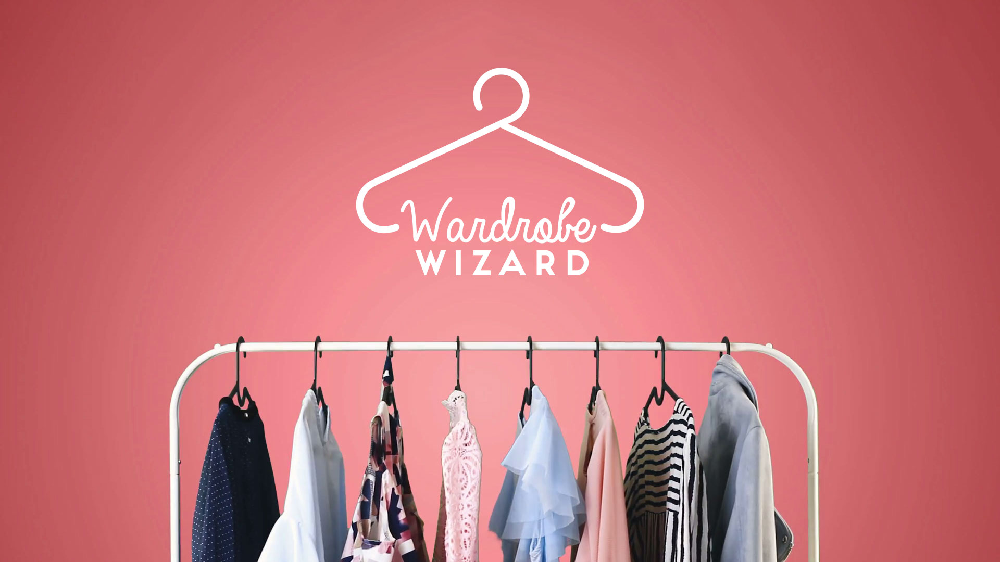

Tutorial
========
In this tutorial we are going to create a part of a backend for a app called Wardrobe Wizard. The app is for creating 
outfits based on certain criterias. An outfit ends up in a vast number of combinations and are a perfect example of
illustrating how to use Puan.

Model
-----

An **outfit** we say must have: 
    - exactly one pair of **shoes**
    - exactly one pair of **bottoms**
    - exactly one **shirt**
    - at most one **hat**
    - one to many **accessories**

Now we also add some more specific rules to our model:
    - a **t-shirt** is a **shirt**
    - **bottoms** are either **shorts** (exclusive) or **trousers**

Explicit modelling
------------------
Let's say we were given a number of clothing items to directly to us:

.. code:: json

    [
        {
            "id": "4c2f9300-cc0e-42c6-b5c8-75ec5bcf4532",
            "name": "Loose jeans",
            "category": {
                "name": "Jeans",
                "id": "jeans"
            }
        },
        {
            "id": "83893701-473c-44e9-9881-a9a403a8a0fc",
            "name": "Regular Mid Wash jeans",
            "category": {
                "name": "Jeans",
                "id": "jeans"
            }
        },
        {
            "id": "1dcb5259-73db-4e73-a2d0-2b883715ee18",
            "name": "Slim Stretch Chinos",
            "category": {
                "name": "Trousers",
                "id": "trousers"
            }
        },
        {
            "id": "517e4b9d-697d-47b4-9701-965c7d46a927",
            "name": "Regular Trousers Cotton Linen",
            "category": {
                "name": "Trousers",
                "id": "trousers"
            }
        },
        {
            "id": "670b14b7-91e8-4045-8bdc-0e24d152c826",
            "name": "T-shirt",
            "category": {
                "name": "T-shirts",
                "id": "t-shirts"
            }
        },
        {
            "id": "1b32e500-3999-4a09-92d1-866f6970153f",
            "name": "T-shirt",
            "category": {
                "name": "T-shirts",
                "id": "t-shirts"
            }
        },
        {
            "id": "e2f97d5e-d4fe-4a8c-933f-43ddb0bd21e6",
            "name": "Oxford Shirt",
            "category": {
                "name": "Shirts",
                "id": "shirts"
            }
        },
        {
            "id": "8a3a0c21-f6a7-4447-bb6a-d278d7077aaa",
            "name": "Relaxed Oxford Shirt",
            "category": {
                "name": "Shirts",
                "id": "shirts"
            }
        },
        {
            "id": "00cba936-1b43-4422-bb1c-b8c9c5b0f173",
            "name": "Relaxed Cotton Twill Overshirt",
            "category": {
                "name": "Shirts",
                "id": "shirts"
            }
        },
        {
            "id": "02ece6a3-a5bd-4ff9-9256-26b0938a621e",
            "name": "Heavy Knit Wool Jumper",
            "category": {
                "name": "Knits",
                "id": "knits"
            }
        },
        {
            "id": "59079abb-8fae-402a-9e44-126165a95fd7",
            "name": "Relaxed Heavyweight Hoodie",
            "category": {
                "name": "sweaters",
                "id": "sweaters"
            }
        },
        {
            "id": "14ec21ec-5892-45ae-adb1-c7dc12b11379",
            "name": "French Terry Sweatshirt",
            "category": {
                "name": "sweaters",
                "id": "sweaters"
            }
        },
        {
            "id": "71a02a66-2614-470d-afd1-c858470e1107",
            "name": "New Balance 997H",
            "category": {
                "name": "Sneakers",
                "id": "sneakers"
            }
        },
        {
            "id": "5c462102-f15d-4cbd-872e-a2a9df5446d5",
            "name": "Saucony Azura Trainers",
            "category": {
                "name": "Sneakers",
                "id": "sneakers"
            }
        },
        {
            "id": "4b89a145-9c2e-479d-8ff3-e8f96b31cc6a",
            "name": "Veja Esplar Trainers",
            "category": {
                "name": "Sneakers",
                "id": "sneakers"
            }
        },
        {
            "id": "ffed933f-8036-43db-89e4-569423840dd8",
            "name": "Leather Chelsea Boots",
            "category": {
                "name": "Boots",
                "id": "boots"
            }
        }
    ]